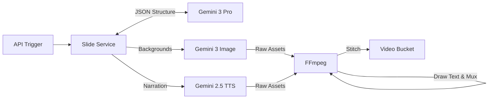
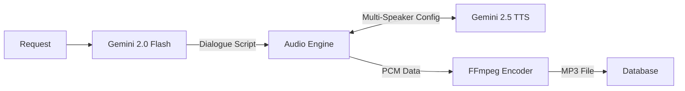

# Seeker Server | The Cortex


> **The Generative Engine behind [Seeker](https://github.com/greatsage-raphael/seeker_prime)**
>
> *Handles long-running agentic workflows, video rendering, and multimedia synthesis.*

## Table of Contents
- [Overview](#overview)
- [System Architecture](#system-architecture)
- [Generative Pipelines](#generative-pipelines)
    - [The Veo Cinematic Engine](#1-the-veo-cinematic-engine)
    - [The Comic Book Factory](#2-the-comic-book-factory)
    - [The Slide Generator](#3-the-slide-generator)
    - [The Podcast Synth](#4-the-podcast-synth)
- [Gemini 3 Integration](#gemini-3-integration)
- [Directory Structure](#directory-structure)
- [Setup & Installation](#setup--installation)

---

## Overview

While the frontend handles real-time interaction, **Seeker Server** acts as the "Cortex"—a NestJS-based agentic orchestration layer. It is responsible for tasks that require heavy computational logic, complex prompting chains, or binary processing (FFmpeg) that cannot execute in a browser environment.

It listens for triggers from the frontend (e.g., "Lesson Completed") and spins up asynchronous jobs to generate high-fidelity media assets using the **Gemini 3 Model Family** and **Google Veo**.

## System Architecture

The server operates as a bridge between the User's state (Supabase) and Google's Generative Cloud.


---

## Generative Pipelines

### 1. The Veo Cinematic Engine
**Goal:** Generate 8-second looping video explainers with consistent characters.
**Innovation:** Solves the "flickering character" problem in AI video by generating a "Character DNA" grid first.

*   **Identity Agent:** Analyzes the lesson to define a visual style and protagonist.
*   **DNA Generator:** Creates a 2x2 Character Reference Grid (Front, Side, Back views).
*   **Veo Production:** Passes the Reference Grid to **Veo 3.1** for every scene generation to ensure the character looks the same in Scene 1 and Scene 4.


## Example Veo Video
[](https://eifeyuvbxmsjjtbtbyuk.supabase.co/storage/v1/object/public/seeker/33d3435d-fe5e-450c-b71b-a3797944f5b8/cinematic_1769537211186.mp4)

### 2. The Comic Book Factory
**Goal:** Convert abstract concepts into a 5-page graphic novel.
**Innovation:** Separates the "Director" (Text/Layout) from the "Artist" (Image Generation).

*   **Director Agent (Gemini 3 Pro):** Reads the lesson notes and outputs a JSON manifest containing panel descriptions, dialogue, and a specific "Visual Anchor" (e.g., "Vintage Ink Style, 1920s setting").
*   **Artist Agent (Gemini 3 Image):** Iterates through the manifest, generating images that strictly adhere to the Director's visual anchors.


### 3. The Slide Generator
**Goal:** Create a traditional video lecture (`.mp4`) from text notes automatically.
**Innovation:** Programmatic video editing. We use Gemini to generate the *assets*, but use FFmpeg to handling the *timing* and *text rendering* for perfect synchronization.

*   **Manifest Agent:** breaks the lesson into 30-second blocks.
*   **Asset Generation:** Parallel generation of TTS Audio (Gemini 2.5) and Background Images (Gemini 3 Image).
*   **FFmpeg Rendering:** Uses complex filter graphs (`drawtext`, `overlay`) to burn text onto the video at specific timestamps.



### 4. The Podcast Synth
**Goal:** Convert a lesson into an engaging 2-person dialogue.
**Innovation:** Multi-speaker synthesis.

*   **Scriptwriter:** Converts notes into a transcript between "Alex" (curious) and "Sam" (expert).
*   **Audio Synth:** Uses **Gemini 2.5 Flash TTS** with `multiSpeakerVoiceConfig` to generate a single audio file with distinct voices.



---

## Gemini 3 Integration

This server relies entirely on the latest Google models:

| Task | Model | Reason |
| :--- | :--- | :--- |
| **Video Generation** | **Google Veo 3.1** | The only model capable of using "Reference Images" (Character DNA) for consistency. |
| **Logic/Scripting** | **Gemini 3 Pro** | Required for complex JSON instruction following (Director Agent). |
| **Image Generation** | **Gemini 3 Image** | High-fidelity text rendering for comic book panels. |
| **Audio** | **Gemini 2.5 Flash TTS** | Low latency, high emotion, and multi-speaker capabilities. |

---

## Directory Structure

```bash
/src
  /slides
    slides.service.ts    # Logic for Comics and Slides (FFmpeg)
    slides.controller.ts # Endpoints: /generate, /generate-comic
  /video
    video.service.ts     # Logic for Veo Cinematic (Character Grid)
    video.controller.ts  # Endpoints: /generate-cinematic
  /app.module.ts         # Config & Dependency Injection
/temp                    # Temporary scratchpad for raw asset generation
```

---

## Setup & Installation

### Prerequisites
1.  **Node.js 20+**
2.  **FFmpeg** must be installed on the host machine (Required for stitching and audio conversion).
    *   Ubuntu: `sudo apt install ffmpeg`
    *   Mac: `brew install ffmpeg`
3.  **Supabase Project** (URL & Service Role Key).
4.  **Google Cloud Project** with Vertex AI enabled.

### Installation

1.  **Clone the repository**
    ```bash
    git clone https://github.com/greatsage-raphael/seeker_server.git
    cd seeker_server
    ```

2.  **Install Dependencies**
    ```bash
    npm install
    ```

3.  **Environment Variables**
    Create a `.env` file in the root:
    ```env
    # Google AI
    GEMINI_API_KEY=AIza...

    # Database & Storage
    SUPABASE_URL=https://your-project.supabase.co
    SUPABASE_SERVICE_ROLE_KEY=eyJ... 
    
    # Server Port
    PORT=3001
    ```

4.  **Run the Server**
    ```bash
    # Development
    npm run start:dev
    
    # Production
    npm run start:prod
    ```